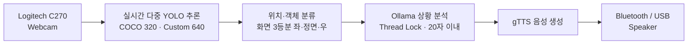
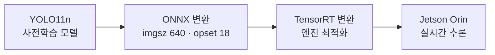

# 시각장애인을 위한 지능형 도보 내비게이션 (On-Device AI)

> **엣지 AI 기반 실시간 음성 안내 가이드** — 다중 YOLO 탐지 + 로컬 LLM(Ollama) 상황 판단 + 음성 출력을
> Jetson Orin Nano 보드 단독으로 수행하는 온디바이스 AI 프로젝트


카메라 영상을 입력받아 **YOLO 실시간 다중 객체 탐지 → 로컬 LLM(Ollama) 상황 판단 → 스피커 음성 안내**까지
클라우드 없이 **엣지에서 단독으로** 동작하는 저지연 온디바이스 AI 파이프라인입니다.
장애물(사람·신호등·차량·횡단보도·계단·맨홀·볼라드 등)을 높은 신뢰도로 탐지하고,
위치 정보에 따라 상황 맞춤형 안내 문장을 생성해 실시간 음성으로 안내합니다.

---

## Team & Role

> **KCCI On Device AI 1기 · 8팀 "눈이돼조"** (김지홍 · 윤수현 · 조준호 · 최은수)

**담당 (최은수)** — 다중 YOLO **데이터셋 구축·정제·균형화**(전처리)와 **모델 경량화**(ONNX/TensorRT 변환) 수행

---

## Highlights

- **다중 YOLO 통합 인식** — COCO 모델 + Custom 모델을 하나의 파이프라인으로 통합
- **모델 경량화** — YOLO11n → ONNX(imgsz 640·opset 18) → **TensorRT(.engine)** 로 Jetson 실시간 추론
- **데이터 전처리** — JSON→YOLO 변환, 클래스 불균형·소형 객체 해결, 6-class 재구성
- **3분할 공간 인지** — 화면을 좌·정면·우로 나눠 객체 방향 안내
- **로컬 LLM 음성 안내** — Ollama 상황 판단 + gTTS 음성 출력 (클라우드 불필요)

---

## System Pipeline



> **Thread Lock** — Ollama 상황 분석이 끝날 때까지 새 카메라 데이터가 LLM으로 유입되지 않도록 차단하는 안전장치

---

## Specification

**Hardware**

| 분류 | 항목 | 역할 |
|------|------|------|
| Main Board | Jetson Orin Nano Developer Kit | 온디바이스 다중 YOLO 추론 · 로컬 LLM 구동 |
| Camera | Logitech C270 HD Webcam (640×480) | 실시간 보행 영상 캡처 |
| Audio | Bluetooth / USB 스피커 | 실시간 안내 음성 출력 |

**Software**

| 분류 | 항목 | 비고 |
|------|------|------|
| Language | Python | — |
| AI Framework | Ultralytics YOLO11 | TensorRT(.engine) 변환 사용 |
| AI Models | 다중 Object Detection | coco(320) · custom×3(640) |
| LLM Engine | Ollama | Gemma3:4b → **Qwen2:0.5b** 경량화 |
| TTS Engine | gTTS (Google TTS) | 한국어 지원 |

---

## Data Processing (담당 파트)

**① JSON → YOLO 라벨 변환**
JSON 라벨을 YOLO 형식으로 변환하고, `traffic_light`의 attribute(red/green/yellow)를 **색상별 클래스로 분리**.
train에서 20%를 추출해 val 데이터셋을 구성.

**② 클래스 불균형 · 소형 객체 문제 해결**

| type | 라벨 있음 | 라벨 없음 | 전체 | 라벨 비율 |
|------|:--------:|:--------:|:----:|:--------:|
| train | 441 | 2015 | 2456 | **18%** |
| val | 128 | 486 | 614 | **21%** |

`traffic_light` 데이터 비중이 낮고 작은 박스를 놓치는 문제 → `imgsz`를 **640으로 상향**, 불필요 클래스(`traffic_sign` 등) 제외, empty 이미지 함께 학습.

**③ 도로 시설물 6-class 재구성**
과다한 클래스를 6개로 축소하고 class별 약 1,200장 규모로 정제 → mAP 안정 수렴, Bollard 등 시설물을 높은 신뢰도로 검출.

---

## Model Optimization



| 모델 | 탐지 대상 |
|------|-----------|
| **COCO 모델** (동적) | 사람 · 자전거 · 차량 · 오토바이 |
| **Custom 모델** (정적) | 신호등 · 볼라드 · 맨홀 · 표지판 |

4개 YOLO의 class ID를 통합 라벨로 매핑해 **단일 인식 파이프라인**으로 구성.

---

## Real-Time Detection 결과

| 상황 | 탐지 (원시) | 음성 안내 (Ollama) |
|------|-------------|--------------------|
| Station/Shelter | 오른쪽에 Station Shelter | "오른쪽으로 역이 있으니 주의하세요" |
| Manhole | 왼쪽·정면 Manhole | "양방향 맨홀 주의, 안전을 확보하세요!" |
| Rainy Night | 왼쪽에 빨간불 | "왼쪽 빨간불, 정지해야 합니다" |
| Evening Downtown | 사람·녹색신호·차량 | "사람, 녹색 신호, 차량에 주의하세요" |

---

## Ollama LLM 음성 안내

- 객체 탐지 결과를 상황에 맞는 자연어 안내로 변환 (프롬프트 **20자 이내** 제어) 후 gTTS로 음성 합성
- 모델을 **Gemma3:4b → Qwen2:0.5b**로 변경해 평균 생성 속도를 약 **3.64 → 18.7 tokens/s**로 개선

---

## 한계 및 개선 방향

- **Ollama 추론 지연** — 경량 모델(Qwen2:0.5b) 전환으로 개선했으나 추가 최적화 여지
- **사물 오인식** — 데이터 정제·클래스 재구성으로 완화, 데이터 다양성 확보로 추가 개선 가능

---

## Demo Video

[](https://github.com/eunsu1209/blind-walk-navigation-yolo/blob/main/docs/KCCI_OnDevice_1기_시연영상%288팀%29.mp4)

시각장애인 도보 내비게이션 실시간 시연 영상 — 위 버튼을 클릭하면 재생 페이지로 이동합니다.

📄 [결과보고서 (PDF)](https://github.com/eunsu1209/blind-walk-navigation-yolo/blob/main/docs/KCCI_%20OnDevice_1기_결과보고서%288팀%29.pdf)

---

## Project Structure

```
blind-walk-navigation-yolo/
├── code/
│   ├── jetson detection code/   # Jetson 온디바이스 실시간 추론 (YOLO·Ollama·gTTS)
│   └── training code/           # YOLO 모델 학습 · 데이터 전처리 코드
├── docs/                        # 결과보고서(PDF), 데모 영상
└── README.md
```

> ⚠️ 데이터셋·모델 가중치(`.engine`·`.onnx`)·영상은 대용량이라 git에 포함하지 않습니다.

---

## Tech Stack

`Python` · `Ultralytics YOLO11` · `ONNX` · `TensorRT` · `Ollama (LLM)` · `gTTS` · `Jetson Orin Nano`

---

<div align="center">

**최은수** · [@eunsu1209](https://github.com/eunsu1209)
_KCCI On Device AI 1기 · 8팀 · 데이터 전처리 & 모델 경량화 담당_

</div>
